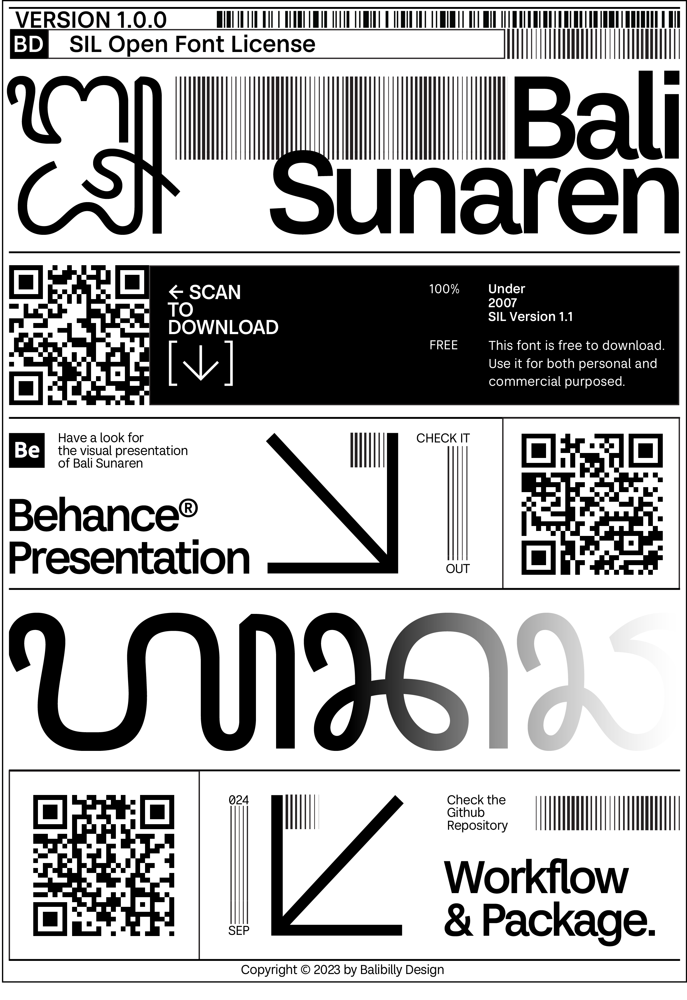

# Bali Sunaren Typeface
Bali Sunaren is a sans-serif typeface that harmonizes **Latin and Balinese scripts** in a cohesive and visually appealing way.

## 🌏 About
Bali is more than just beaches, rice fields, and temples—it's our creative playground! Bali Sunaren was designed to **celebrate Balinese script and culture** while maintaining high functionality for modern typography.

## 🎨 Design & Concept
The concept of **harmonization** is at the core of Bali Sunaren. We carefully balanced the unique characteristics of **Latin and Balinese** scripts to ensure visual and technical compatibility.

## 🔍 Key Features:
✅ Supports **Balinese Unicode & Latin Core Glyphset**  
✅ Neo-Grotesque influence for Latin characters  
✅ **Open-source** (OFL License) – Free for personal & commercial use  
✅ Optimized for **both print and digital use**  
✅ Includes OpenType features for accurate diacritics placement  

## 🚀 Installation & Usage
To use Bali Sunaren, install the font as usual for **Latin script**. For **Balinese script**, you need to install the **Keyman Keyboard**.  
🔹 Download Keyman Keyboard: [https://keyman.com/](https://keyman.com/)  
🔹 Select **Balinese Unicode Keyboard** in the settings  

## 📷 Preview

## 🔗 Download
[⬇️ Download Bali Sunaren](https://github.com/Balibilly/BaliSunaren-SansSerif/releases/tag/Balinese)

## 📜 License
This font is licensed under the **Open Font License (OFL v1.1)**.  
For details, see the [OFL.txt](OFL.txt) file in this repository.